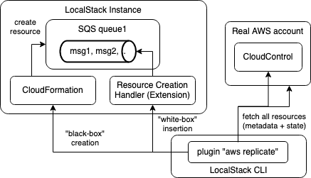

AWS Replicator Extension (experimental)
========================================

A LocalStack extension to replicate AWS resources into your local machine.

⚠️ Please note that this extension is experimental and currently under active development.

## Prerequisites

* LocalStack Pro
* Docker
* Python

## Overview

This extension currently offers two modes of operation: (1) the AWS connection proxy, and (2) the resource replicator CLI.

## AWS Connection Proxy

The AWS connection proxy can be used to forward certain API calls in LocalStack to real AWS, in order to enable seamless transition between local and remote resources.

For example, in order to forward all API calls for DynamoDB/S3/Cognito to real AWS, the proxy can be started via the CLI as follows:
```
# configure terminal session to allow access to a real cloud account
$ export AWS_ACCESS_KEY_ID=... AWS_SECRET_ACCESS_KEY=...
# start proxy via the CLI
$ localstack aws proxy -s dynamodb,s3,cognito-idp
```

**Warning:** Be careful when using the proxy - make sure to _never_ give access to production accounts or any critical/sensitive data!

### Resource-specific proxying

As an alternative to forwarding _all_ requests for a particular service, you can also proxy only requests for _specific_ resources to AWS.

For example, assume we own an S3 bucket `my-s3-bucket` in AWS, then we can use the following configuration to forward any requests to `s3://my-s3-bucket` to real AWS, while still handling requests to all other buckets locally in LocalStack:
```
services:
  s3:
    resources:
      # list of ARNs of S3 buckets to proxy to real AWS
      - '.*:my-s3-bucket'
    operations:
      # list of operation name regex patterns (optional)
      - 'Get.*'
      - 'Put.*'
    # optionally, specify that only read requests should be allowed (Get*/List*/Describe*, etc)
    read_only: false
```

Store the configuration above to a file named `proxy_config.yml`, then we can start up the proxy via:
```
localstack aws proxy -c proxy_config.yml
```

If we then perform local operations against the S3 bucket `my-s3-bucket`, the proxy will forward the request and will return the results from real AWS:
```
$ awslocal s3 ls s3://my-s3-bucket
2023-05-14 15:53:40        148 my-file-1.txt
2023-05-15 10:24:43         22 my-file-2.txt
```

Any other S3 requests targeting other buckets will be run against the local state in LocalStack itself, for example:
```
$ awslocal s3 mb s3://test123
make_bucket: test123
...
```

A more comprehensive sample, involving local Lambda functions combined with remote SQS queues and S3 buckets, can be found in the `example` folder of this repo.

## Resource Replicator CLI

The figure below illustrates how the extension can be used to replicate the state, e.g., an SQS queue and the messages contained in it, from AWS into your LocalStack instance.



To use the resource replicator, make sure that you have access to AWS configured in your terminal. Note: the extension will only talk to AWS in read-only mode, and will **not** make any changes to your real AWS account.

The following command can be used to replicate SQS queues (incl. their messages) into your LocalStack instance:
```
$ localstack aws replicate -s sqs
```

Once the command has completed, you should be able to list and interact with the queue that was replicated into your local account:
```
$ awslocal sqs list-queues
...
$ awslocal sqs receive-message --queue-url ...
...
```

## Installing

To install the CLI extension, use the following `pip` command:
```bash
pip install "git+https://github.com/localstack/localstack-extensions/#egg=localstack-extension-aws-replicator&subdirectory=aws-replicator"
```

To install the extension itself (server component running inside LocalStack), use the following `extensions` command:
```bash
localstack extensions install "git+https://github.com/localstack/localstack-extensions/#egg=localstack-extension-aws-replicator&subdirectory=aws-replicator"
```

## License

This extension is published under the Apache License, Version 2.0.
By using it, you also agree to the LocalStack [End-User License Agreement (EULA)](https://github.com/localstack/localstack/tree/master/doc/end_user_license_agreement).
