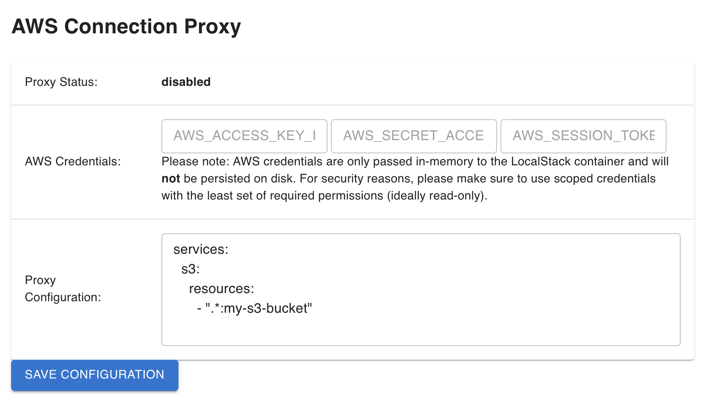

AWS Cloud Proxy Extension (experimental)
========================================
[](https://app.localstack.cloud/extensions/remote?url=git+https://github.com/localstack/localstack-extensions/#egg=localstack-extension-aws-replicator&subdirectory=aws-replicator)

A LocalStack extension to proxy and integrate AWS resources into your local machine.
This enables one flavor of "hybrid" or "remocal" setups where you can easily bridge the gap between LocalStack (local resources) and remote AWS (resources in the real cloud).

⚠️ Please note that this extension is experimental and still under active development.

⚠️ Note: Given that the scope of this extension has recently changed (see [below](#resource-replicator-cli-deprecated)), it may get renamed from `aws-replicator` to `cloud-proxy` in an upcoming release.

## Prerequisites

* LocalStack Pro
* Docker
* Python

## AWS Cloud Proxy

The AWS Cloud Proxy can be used to forward certain API calls in LocalStack to real AWS, in order to enable seamless transition between local and remote resources.

**Warning:** Be careful when using the proxy - make sure to _never_ give access to production accounts or any critical/sensitive data!

**Note:** The Cloud Proxy CLI currently works only when installing the `localstack` CLI via `pip`.
If you're downloading the `localstack` CLI as a [binary release](https://docs.localstack.cloud/getting-started/installation/#localstack-cli), then please use the proxy configuration UI described below.

### Usage

#### CLI
For example, in order to forward all API calls for DynamoDB/S3/Cognito to real AWS, the proxy can be started via the CLI as follows:

1. Start LocalStack via CLI
```
$ localstack start -d
```
2. Enable LocalStack AWS replicator from the Web Application Extension Library
3. After installation restart Localstack
4. Install the AWS replicator CLI package
```
$ pip install localstack-extension-aws-replicator
```
5. Configure real cloud account credentials in a new terminal session to allow access
```
$ export AWS_ACCESS_KEY_ID=... AWS_SECRET_ACCESS_KEY=...
```
6. Start proxy in aforementioned terminal session via the CLI
```
$ localstack aws proxy -s dynamodb,s3,cognito-idp
```
7. Now, when issuing an API call against LocalStack (e.g., via `awslocal`), the invocation gets forwarded to real AWS and should return data from your real cloud resources.

#### Proxy Configuration UI

1. Start Localstack with extra CORS
```
EXTRA_CORS_ALLOWED_ORIGINS=https://aws-replicator.localhost.localstack.cloud:4566 localstack start -d
```

2. Enable Localstack AWS replicator from the Web Application Extension Library

3. Once the extension is installed, it will expose a small configuration endpoint in your LocalStack container under the following endpoint: http://localhost:4566/_localstack/aws-replicator/index.html . 

4. Use this Web UI to define the proxy configuration (in YAML syntax), as well as the AWS credentials (AWS access key ID, secret access key, and optionally session token) and save configuration. The proxy should report enabled state and on the host a proxy container should spawn.



5. Now we can communicate with the real AWS cloud resources, directly via LocalStack.

To clean up the running proxy container simply click "disable" on the Cloud Proxy UI.

### Resource-specific proxying

As an alternative to forwarding _all_ requests for a particular service, you can also proxy only requests for _specific_ resources to AWS.

For example, assume we own an S3 bucket `my-s3-bucket` in AWS, then we can use the following configuration to forward any requests to `s3://my-s3-bucket` to real AWS, while still handling requests to all other buckets locally in LocalStack:
```
services:
  s3:
    resources:
      # list of ARNs of S3 buckets to proxy to real AWS
      - '.*:my-s3-bucket'
    operations:
      # list of operation name regex patterns (optional)
      - 'Get.*'
      - 'Put.*'
    # optionally, specify that only read requests should be allowed (Get*/List*/Describe*, etc)
    read_only: false
```

Store the configuration above to a file named `proxy_config.yml`, then we can start up the proxy via:
```
localstack aws proxy -c proxy_config.yml
```

If we then perform local operations against the S3 bucket `my-s3-bucket`, the proxy will forward the request and will return the results from real AWS:
```
$ awslocal s3 ls s3://my-s3-bucket
2023-05-14 15:53:40        148 my-file-1.txt
2023-05-15 10:24:43         22 my-file-2.txt
```

Any other S3 requests targeting other buckets will be run against the local state in LocalStack itself, for example:
```
$ awslocal s3 mb s3://test123
make_bucket: test123
...
```

A more comprehensive sample, involving local Lambda functions combined with remote SQS queues and S3 buckets, can be found in the `example` folder of this repo.

### Configuration

In addition to the proxy services configuration shown above, the following configs can be used to customize the behavior of the extension itself (simply pass them as environment variables to the main LocalStack container):
* `REPLICATOR_CLEANUP_PROXY_CONTAINERS`: whether to clean up (remove) the proxy Docker containers once they shut down (default `1`). Can be set to `0` to help debug issues, e.g., if a proxy container starts up and exits immediately.
* `REPLICATOR_LOCALSTACK_HOST`: the target host to use when the proxy container connects to the LocalStack main container (automatically determined by default)
* `REPLICATOR_PROXY_DOCKER_FLAGS`: additional flags that should be passed when creating the proxy Docker containers

**Note:** Due to some recent changes in the core framework, make sure to start up your LocalStack container with the `GATEWAY_SERVER=hypercorn` configuration enabled, for backwards compatibility. This will be fixed in an upcoming release.

## Resource Replicator CLI (deprecated)

Note: Previous versions of this extension also offered a "replicate" mode to copy/clone (rather than proxy) resources from an AWS account into the local instance.
This functionality has been removed from this extension, and is now being migrated to a new extension (more details following soon).

If you wish to access the deprecated instructions, they can be found [here](https://github.com/localstack/localstack-extensions/blob/fe0c97e8a9d94f72c80358493e51ce6c1da535dc/aws-replicator/README.md#resource-replicator-cli).

## Change Log

* `0.1.25`: Fix dynamodb proxying for read-only mode.
* `0.1.24`: Fix healthcheck probe for proxy container
* `0.1.23`: Fix unpinned React.js dependencies preventing webui from loading
* `0.1.22`: Fix auth-related imports that prevent the AWS proxy from starting
* `0.1.20`: Fix logic for proxying S3 requests with `*.s3.amazonaws.com` host header
* `0.1.19`: Print human-readable message for invalid regexes in resource configs; fix logic for proxying S3 requests with host-based addressing
* `0.1.18`: Update environment check to use SDK Docker client and enable starting the proxy from within Docker (e.g., from the LS main container as part of an init script)
* `0.1.17`: Add basic support for ARN-based pattern-matching for `secretsmanager` resources
* `0.1.16`: Update imports for localstack >=3.6 compatibility
* `0.1.15`: Move localstack dependency installation to extra since it's provided at runtime
* `0.1.14`: Install missing dependencies into proxy container for localstack >=3.4 compatibility
* `0.1.13`: Add compatibility with localstack >=3.4; add http2-server; migrate to localstack auth login
* `0.1.12`: Modify aws credentials text field type to password  
* `0.1.11`: Fix broken imports after recent upstream CloudFormation changes
* `0.1.10`: Add `REPLICATOR_PROXY_DOCKER_FLAGS` option to pass custom flags to proxy Docker containers
* `0.1.9`: Enhance proxy networking and add `REPLICATOR_LOCALSTACK_HOST` config option
* `0.1.8`: Add `REPLICATOR_CLEANUP_PROXY_CONTAINERS` option to skip removing proxy containers for debugging
* `0.1.7`: Add rolo dependency to tests
* `0.1.6`: Adjust config to support `LOCALSTACK_AUTH_TOKEN` in addition to legacy API keys
* `0.1.5`: Minor fix to accommodate recent upstream changes
* `0.1.4`: Fix imports of `bootstrap.auth` modules for v3.0 compatibility
* `0.1.3`: Adjust code imports for recent LocalStack v3.0 module changes
* `0.1.2`: Remove deprecated ProxyListener for starting local aws-replicator proxy server
* `0.1.1`: Add simple configuration Web UI
* `0.1.0`: Initial version of extension

## License

This extension is published under the Apache License, Version 2.0.
By using it, you also agree to the LocalStack [End-User License Agreement (EULA)](https://github.com/localstack/localstack/tree/master/doc/end_user_license_agreement).
