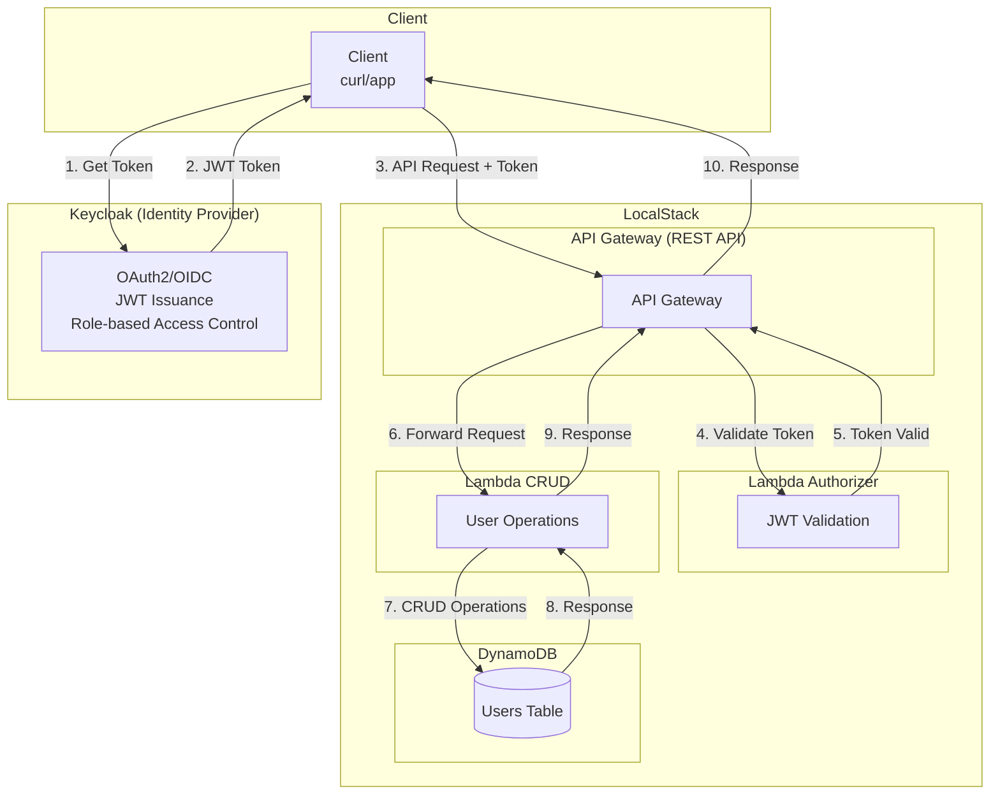

# Keycloak Sample Application

This sample demonstrates how to build a user management API using:
- **Keycloak** for authentication and authorization
- **API Gateway** for REST API
- **Lambda** for business logic with JWT validation
- **DynamoDB** for data storage

## Architecture



## Prerequisites

- LocalStack running with Keycloak extension
- Python 3.10+
- AWS CDK Local (`cdklocal`)

## Quick Start

### 1. Start LocalStack

```bash
EXTENSION_AUTO_INSTALL=localstack-extension-keycloak localstack start
```

### 2. Deploy the Stack

```bash
cd cdk
pip install -r requirements.txt
cdklocal bootstrap
cdklocal deploy --all --require-approval never
```

### 3. Test the API

```bash
# Get a token
TOKEN=$(curl -s -X POST \
  "http://keycloak.localhost.localstack.cloud:4566/realms/localstack/protocol/openid-connect/token" \
  -d "grant_type=client_credentials" \
  -d "client_id=localstack-client" \
  -d "client_secret=localstack-client-secret" | jq -r '.access_token')

# Get API URL
API_ID=$(awslocal apigateway get-rest-apis --query 'items[0].id' --output text)
API_URL="http://localhost:4566/_aws/execute-api/${API_ID}/prod"

# List users
curl -s -H "Authorization: Bearer $TOKEN" "${API_URL}/users" | jq .

# Create user
curl -s -X POST "${API_URL}/users" \
  -H "Authorization: Bearer $TOKEN" \
  -H "Content-Type: application/json" \
  -d '{"username": "john", "email": "john@example.com", "name": "John Doe"}' | jq .

# Get user
curl -s -H "Authorization: Bearer $TOKEN" "${API_URL}/users/john" | jq .

# Update user
curl -s -X PUT "${API_URL}/users/john" \
  -H "Authorization: Bearer $TOKEN" \
  -H "Content-Type: application/json" \
  -d '{"email": "john.doe@example.com"}' | jq .

# Delete user
curl -s -X DELETE -H "Authorization: Bearer $TOKEN" "${API_URL}/users/john" | jq .
```

### 4. Verify Token Claims

You can decode the token to see your roles:

```bash
# Decode JWT payload using Python (handles base64url padding correctly)
PAYLOAD=$(echo $TOKEN | cut -d'.' -f2)
python3 -c "import sys,json,base64; p=sys.argv[1]; print(json.dumps(json.loads(base64.urlsafe_b64decode(p+'='*(4-len(p)%4))), indent=2))" "$PAYLOAD"
```

The expected output should include:
```json
{
  "realm_access": {
    "roles": ["offline_access", "admin", "default-roles-localstack", "uma_authorization", "user"]
  },
  "azp": "localstack-client",
  ...
}
```

> **Note**: The `admin` role confirms the service account can perform CRUD operations.

## Project Structure

```
sample-app/
├── cdk/
│   ├── app.py              # CDK entry point
│   ├── stacks/
│   │   └── api_stack.py    # API Gateway + Lambda + DynamoDB
│   └── requirements.txt
├── lambda/
│   ├── authorizer/
│   │   └── handler.py      # JWT validation
│   └── users/
│       └── handler.py      # User CRUD
└── README.md
```

## Lambda Authorizer

The authorizer Lambda validates Keycloak JWTs:

1. Extracts token from `Authorization: Bearer <token>` header
2. Fetches Keycloak public keys from JWKS endpoint
3. Validates token signature, expiration, and audience
4. Extracts roles from token claims
5. Returns IAM policy allowing/denying access

## Roles and Permissions

| Role | Permissions |
|------|-------------|
| `admin` | Full CRUD access |
| `user` | Read-only access |

The default service account (`localstack-client`) has the `admin` role.
