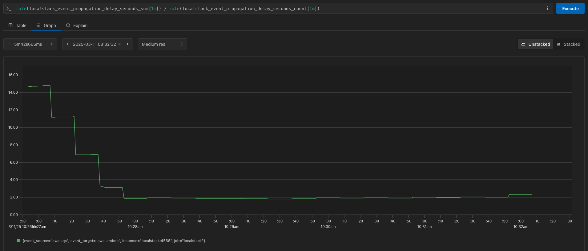
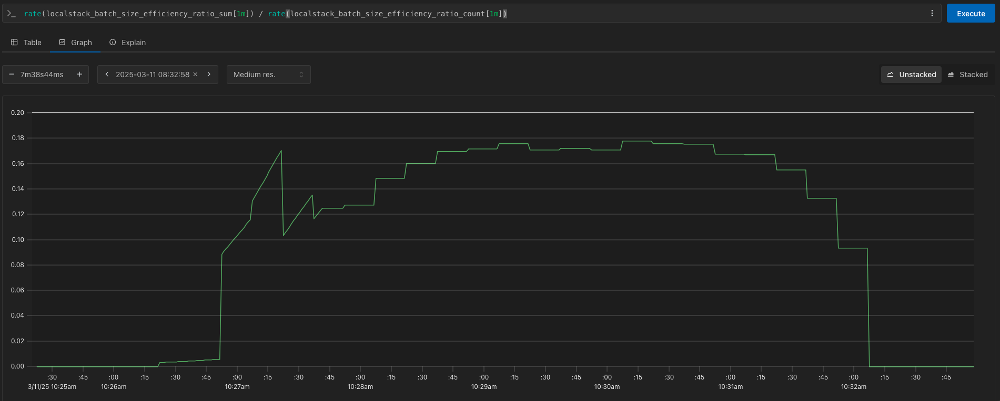
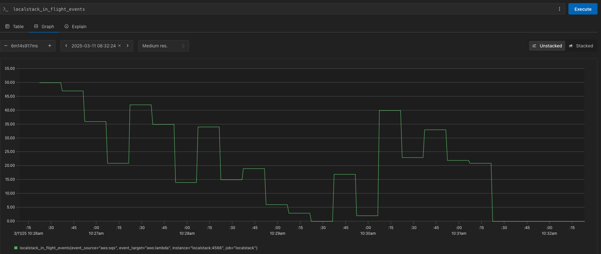
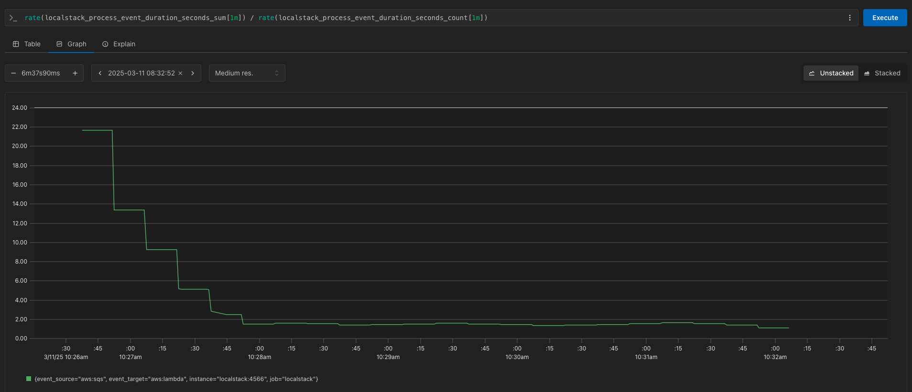
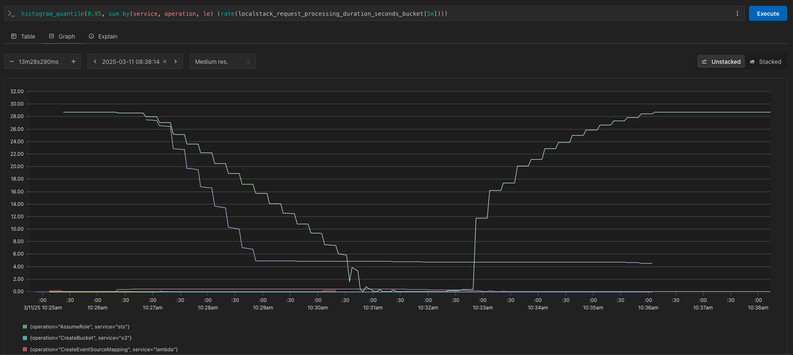
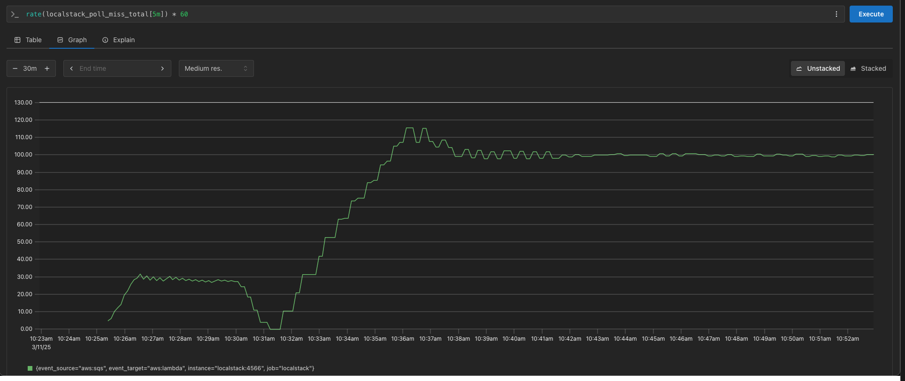
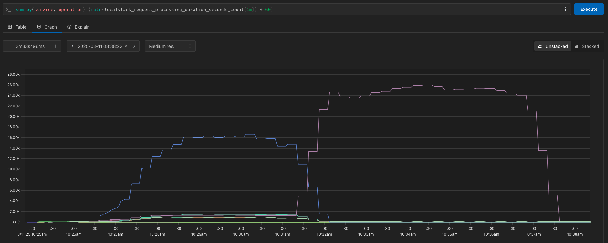
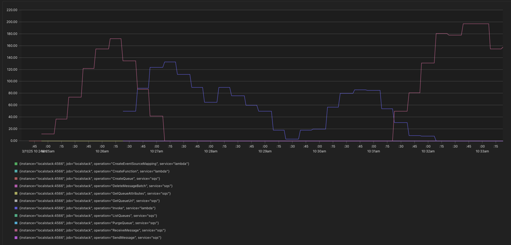

# PromQL Queries for Event Processing Statistics

The following queries can be used to analyse performance of LocalStack's event processing capabilties.

## Average Propagation Delay from Event Source to Poller

The average amount of time a record has to wait before being processed during the last 5 minutes. A high propagation delay indicates that our event pollers are taking too long to ingest new events from an event source.

```
rate(localstack_event_propagation_delay_seconds_sum[5m]) / rate(localstack_event_propagation_delay_seconds_count[5m])
```

**Example**:


## Batch Efficiency

A ratio showing how efficiently are our pollers retrieving records from an event source relative to how large their maximum batch size is. A higher number indicates that batch sizes could be increased.

```
rate(localstack_batch_size_efficiency_ratio_sum[1m]) / rate(localstack_batch_size_efficiency_ratio_count[1m])
```

Example:


## Records Per Poll

The average number of records being pulled in by an event poller per minute. When used in conjunction with batch efficiency, you can interpret the performance of your batching configuration.

```
rate(localstack_records_per_poll_sum[1m]) / rate(localstack_records_per_poll_count[1m])
```

Example:


## In-Flight Events

Gauges how many events are currently being processed by a target at a given point in time. If event processing is taking long, this is a good way of measuring back-pressure on the system.

```
localstack_in_flight_events
```

Example:


## Event Processing Duration

The average duration per minute that targets are processing events for.

```
rate(localstack_process_event_duration_seconds_sum[1m]) / rate(localstack_process_event_duration_seconds_count[1m])
```

Example:



## High Latency Event Processing

Retrieve the 95th percentile of processing times in a 5m interval grouped by LocalStack service and operation. Useful for analysing the tail-latency of event processing since this is likely where bottlenecks in performance start to show.

```
histogram_quantile(0.95, sum by(service, operation, le) (rate(localstack_request_processing_duration_seconds_bucket[5m])))
```

Example:


## Empty Poll Responses

The approximate number of empty poll requests in a 5 minute interval.

```
rate(localstack_poll_miss_total[5m]) * 60
```

Example:


## Number of LocalStack requests Processed

The average number of request processed by the LocalStack gateway per minute. This is grouped by service type (i.e SQS) and operation type (i.e ReceiveMessage)

```
sum by(service, operation) (rate(localstack_request_processing_duration_seconds_count[1m]) * 60)
```

Example:


## In-Flight Requests Against LocalStack Gateway

Measures how many requests the Kinesis, SQS, DynamoDB, and Lambda services are currently processing in a given minute interval. Useful for seeing how hard a given service is currently being hit and the operation type.

```
sum_over_time(localstack_in_flight_requests{service=~"dynamodb|kinesis|sqs|lambda"}[1m])
```

Example:
